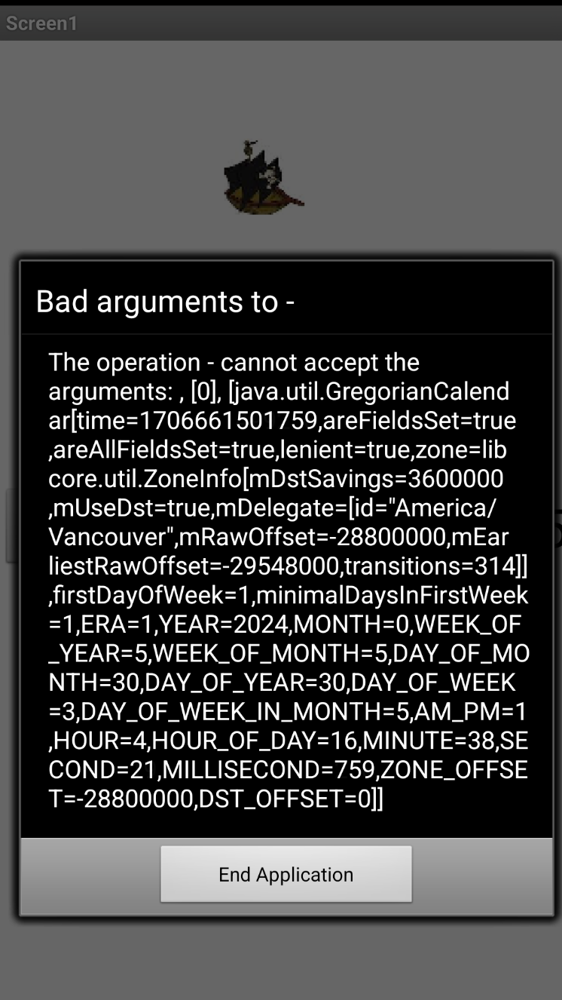

# Get the Gold Debugging Guide
_A guide for debugging activities in `AI2` using the app Get the Gold as an example._

## Introduction
This repository is intended as a guide to support debugging activities using `AI2`. Much as with the previous refactoring guide it's important to note a couple caveats up front:
1. Debugging in `AI2` is not a well-supported experience. There are no debugging tools available, and there isn't even really a good way to log any output. Instead, you'll have to rely heavily on your intuition and some of the debugging techniques you may have previously developed.
2. It's a good idea have ready access to the [`AI2` documentation](http://ai2.appinventor.mit.edu/reference/), especially the [blocks reference](http://ai2.appinventor.mit.edu/reference/blocks/) and the [components reference](http://ai2.appinventor.mit.edu/reference/components/), which provide detailed information explaining the purpose and use of each code block and component.

Again, similar to the refactoring guide, `AI2`, debugging in this sense isn't a comfortable or easy experience. The lack of readily available debugging supports in `AI2` effectively highlights many key _foundational_ and non-tool-based debugging skills that software developers must develop.

## How to use this repository
This repository contains:
1. A guide (this document) describing some debugging techniques you can use in `AI2`.
2. A complete version of the Get the Gold app (`GetTheGold.aia`) downloaded from the [Get the Gold tutorial](http://appinventor.mit.edu/explore/ai2/get-gold.html).
3. A modified version of the Get the Gold app (`GetTheGold_broken.aia`). This modification includes additional features added beyond the base app, and many bugs introduced along with these features. 

You should clone this repository so that you have copies of both `.aia` files locally. You are welcome to follow the steps in the guide below, or to strike out on your own, if you're feeling comfortable with `AI2` already.

## A guide to debugging in `AI2`

### Goal
The main goal of this guide is to present you with some ideas to consider when debugging in `AI2` projects. This will help you in the following ways:
1. It will improve your understanding of `AI2`-based development.
2. It will help you identify potential debugging strategies for your own `AI2` project.
3. It will help you to consider debugging techniques (not tools!) that you can use in other projects outside of `AI2`.

This guide is less of a walkthrough than the comparable refactoring guide. The reason for this is that I'd like to ensure you have the opportunity to take a more active role in adapting debugging techniques you've used in the past to the `AI2` context. As such, the following elements are strong recommendations and advice that you should adopt in your debugging attempt and practice.

### Read the error messages!
This is undoubtedly advice you've heard many times before, but it bears repeating! Although they are typically uncomfortable to read, error messages do provide an awful lot of information. Even when you don't know fully what the source of a particular error is, an error message can help to narrow the possibilities down. 

Consider the following error message (which you will undoubtedly see as you are working with `GetTheGold_broken.aia`):

What does this error tell you about the source of the error? Here are some suggestions:
- Consider the opening statement carefully - what is it communicating?
- Consider the data - what does the _type_ of data present in the error communicate?

### Consider error frequency and conditions
If you don't immediately know what the source of an error is consider when and how often the error appears. An error that appears frequently must have some relationship to a regular event in your code; an error that appears under certain conditions must be related in some way to those conditions. This information can be extremely valuable in narrowing down the source of an error (i.e. _where_ the error occurs in code) - perhaps even more so than the text of the error (although the text will better explain the _why_ of the error).

Consider again the error in Get the Gold pictured above: There are two situations under which it appears, although you may not immediately be able to distinguish one from the other. As you narrow down your understanding of the error, and possibly change some code, you might come across a situation where you see the error more or less frequently, and possibly only under certain conditions. Use this information to help you identify how to _fix_ the error.

### Gather context
When you know - or at least think you know - where the source of a bug is in code, gather as much context as possible by carefully [tracing](https://pages.cs.wisc.edu/~cs310-1/modules/Programming/Conditional%20Execution%20and%20Code%20Tracing/Code%20Tracing/TopicDiscussion.html) the code. Manual tracing (meaning where the programmer _reads_ the code and _traces_ the execution steps) is a critical skill that can help to identify areas of potentially brittle code or faulty assumptions. Remember not to rely _too_ heavily on comments in code to support your understanding, as these could be out of date. 

### Work with a friend
It is always helpful to speak ideas and interpretations out loud. Explaining a section of code to someone else will force you to use precise language that you might overlook when examining code on your own.

## Conclusion
You might have raised an eyebrow reading the above: The suggestions are relatively simple, and probably are fairly obvious; however, it is quite surprising how many novice coders _don't_ take the steps above. In fact, as you become more experienced, the recommendations above will become like second nature, but until then you may need to work very deliberately to ensure you don't forget! It can be very easy to [spin your wheels](https://dictionary.cambridge.org/dictionary/english/spin-wheels), especially when it comes to the common mistaken assumption that a particular issue will be easy to solve. Be intentional about solving bugs and issues - take a scientific approach and make sure you cover all potential cases!
